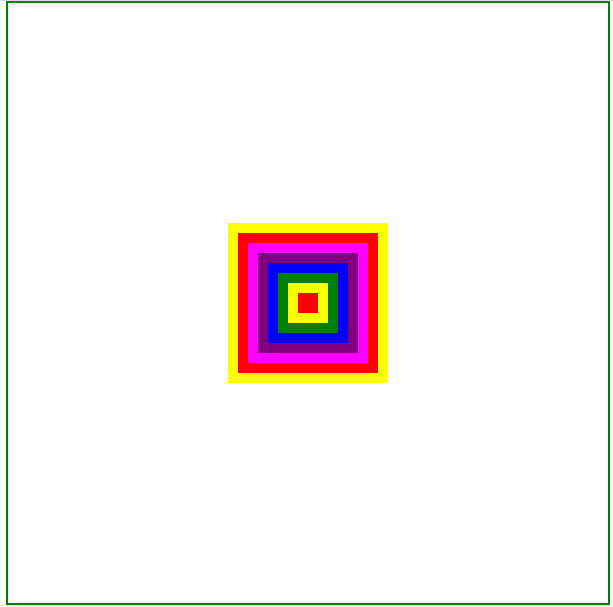

(1p) On a web page, display a canvas having a size of 600x600px, horizontally centered on the screen, and surrounded by a 2px solid green border.

(1p) Display on the page one text input and one button. The text input must have Bootstrap’s default styling. The button should also be styled with Bootstrap, using the danger contextual class.

(0.5p) Restrict the input to only accept integer numbers between 1 and 10.

(1.5p) If the screen is large, the input should be displayed on ¾ of the width of the screen and the button on ¼ of the screen. If the screen is medium, the elements should have equal widths. If the screen is small, they should both occupy the entire width of the screen and be placed one under the other.

(1p) The user should be able to click the button to trigger the drawing. If the value provided in the input is invalid, add a danger Bootstrap alert on the screen containing the text "Invalid input" and don't draw anything on the canvas

(4p) If the input is valid, draw as many squares as indicated in the input, using the following rules:

-   all squares must be centered on the canvas and visible
-   the size of the first square is 20x20. The next squares increase their sizes in increments of 20px (second square will be 40x40, third square will be 60x60, fourth square will be 80x80 etc.)
-   the color of each square must follow this sequence, from the smallest square to the largest: red, yellow, green, blue, purple, magenta
-   if the number of squares exceeds the number of available color, repeat the same sequence
-   the users should be able to change the value in the textbox and render the new drawing upon a new button click

Example: if the number provided by the user is 8, the program will draw 8 squares, like in the image below:

